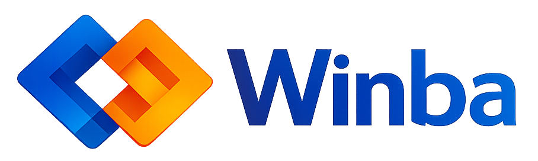
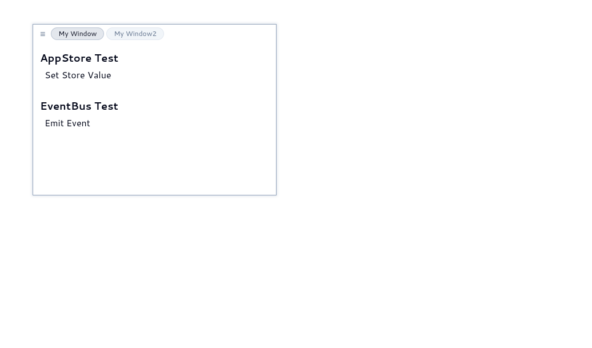

# Winba — Windows Management Framework

Winba is an extensible window management framework built for creating complex, desktop-like web applications. It provides a robust architecture for apps that require multi-view interfaces, such as IDEs, dashboard systems, or diagram editors.




## Description

WM7 brings the power of a desktop operating system's windowing environment to the web. It uses a centralized reactive store to manage window lifecycles, stacking order (z-index), and positioning. 

### Key Features:
- **Dynamic Window Management**: Register and control windows programmatically.
- **Interactive UI**: Fully movable and resizable windows with **snap guides** and a modern **floating header** design.
- **Tabbed Grouping**: Drag and drop headers to merge windows into tabs; tear them off to separate.
- **Persistent Layouts**: Window positions, sizes, and groups are automatically saved to `localStorage`.
- **Reactive Architecture**: Built on Svelte stores for high-performance state updates.
- **Theme Support**: Integrated light and dark modes with Catppuccin-inspired color palettes.

## Install

This project uses [Bun](https://bun.sh/) as the runtime and package manager.

```sh
# Install dependencies
bun install
```

## Usage

Start the development server with Hot Module Replacement (HMR):

```sh
bun run dev
```

## Development

### Adding a New Window
To create a new window:
```html
<script>
  import Window from '$lib/components/Window.svelte';
  // Retrieve config from store or define locally
  const myConfig = {
    id: 'my-window',
    title: 'Application Terminal',
    bounds: { x: 100, y: 100, w: 600, h: 400 },
    boundsLimits: { minW: 300, minH: 200 },
    hasHeader: true,
    resizable: true,
    movable: true,
    visible: true,
    groupId: ""
  };
</script>

<Window config={myConfig}>
    <h1>Hello World</h1>
</Window>
```

## Tech Stack

WM7 is built with a modern, high-performance stack:

- **Framework**: [SvelteKit](https://kit.svelte.dev/) (Svelte 5)
- **Styling**: [Tailwind CSS v4](https://tailwindcss.com/)
- **Core Logic**: [TypeScript](https://www.typescriptlang.org/)
- **Runtime**: [Bun](https://bun.sh/)
- **UI Components**: [Bits UI](https://www.bits-ui.com/)
- **Icons**: [Lucide Svelte](https://lucide.dev/)
- **Theme Engine**: Custom CSS Variables system with Dark/Light support.
