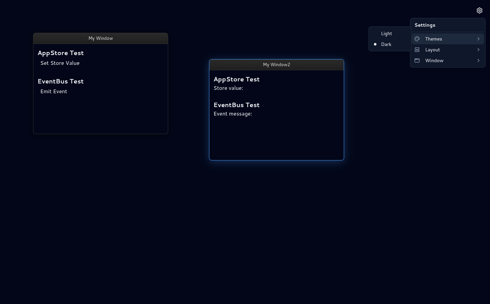

# WM7 — Windows Management Framework

WM7 is a high-performance, extensible window management framework built for creating complex, desktop-like web applications. It provides a robust architecture for apps that require multi-view interfaces, such as IDEs, dashboard systems, or diagram editors.



## Description

WM7 brings the power of a desktop operating system's windowing environment to the web. It uses a centralized reactive store to manage window lifecycles, stacking order (z-index), and positioning. 

### Key Features:
- **Dynamic Window Management**: Register and control windows programmatically.
- **Interactive UI**: Fully movable, resizable, and snappable windows.
- **Reactive Architecture**: Built on Svelte stores for high-performance state updates.
- **Theme Support**: Integrated light and dark modes with Catppuccin-inspired color palettes.
- **Extensible Plugin System**: Designed to host independent "plugins" with their own UI and APIs.
- **Developer-Centric**: Strong TypeScript typing for all core components and configurations.

## Install

This project uses [Bun](https://bun.sh/) as the runtime and package manager.

```sh
# Install dependencies
bun install
```

## Usage

Start the development server with Hot Module Replacement (HMR):

```sh
bun run dev
```

### Other Commands:
- **Build**: `bun run build` — Create a production-ready build.
- **Preview**: `bun run preview` — Locally preview the production build.
- **Check**: `bun run check` — Run Svelte-check and TypeScript validation.

### Configuration
Windows can be configured via `windows.config.json` or dynamically through the `WindowsStore`.

```json
{
  "id": "my-window",
  "title": "Application Terminal",
  "bounds": { "x": 100, "y": 100, "w": 600, "h": 400 },
  "resizable": true,
  "movable": true
}
```

## Tech Stack

WM7 is built with a modern, high-performance stack:

- **Framework**: [SvelteKit](https://kit.svelte.dev/) (Svelte 5)
- **Styling**: [Tailwind CSS v4](https://tailwindcss.com/)
- **Core Logic**: [TypeScript](https://www.typescriptlang.org/)
- **Runtime**: [Bun](https://bun.sh/)
- **UI Components**: [Bits UI](https://www.bits-ui.com/)
- **Icons**: [Lucide Svelte](https://lucide.dev/)
- **Theme Engine**: Custom CSS Variables system with Dark/Light support.
